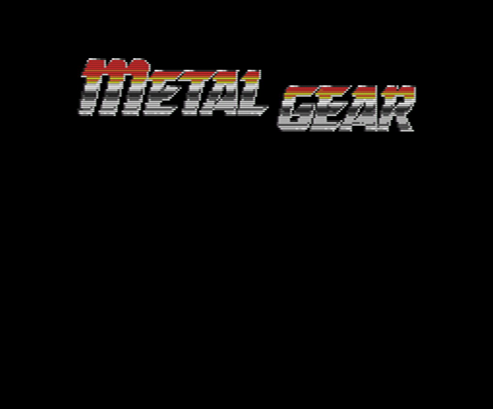
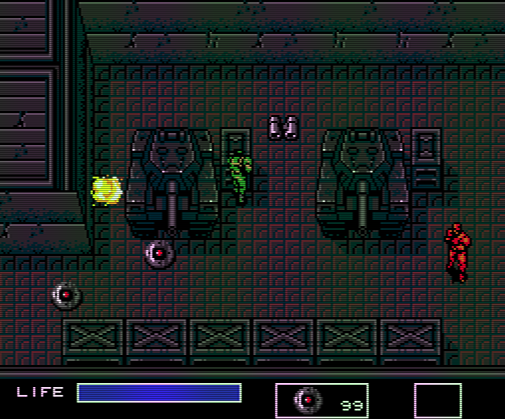
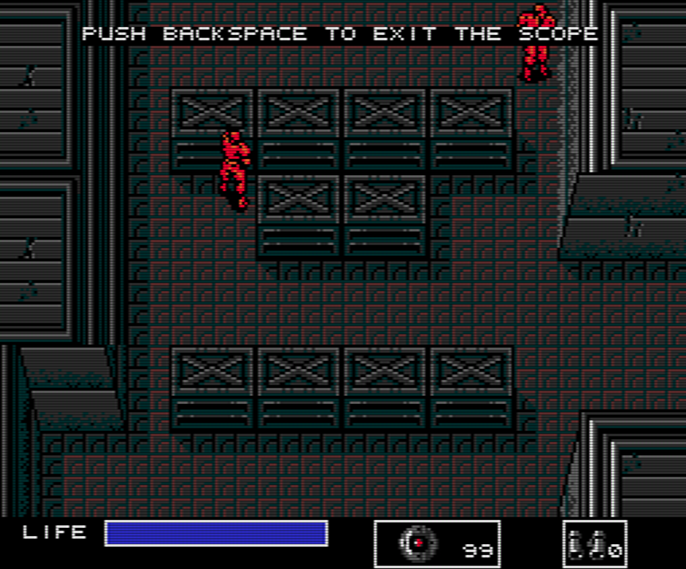
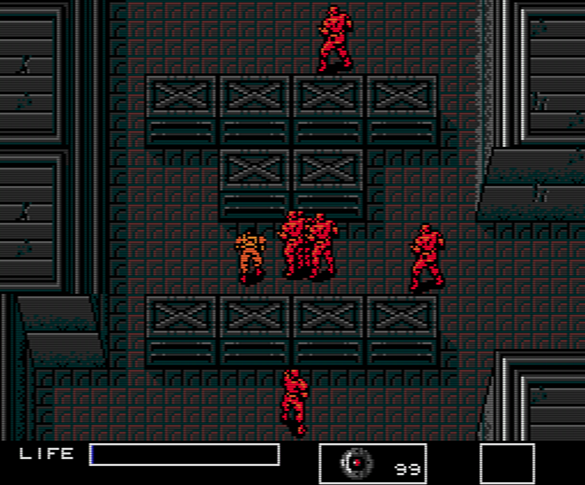

# Metal Gear 1 MSX2 Outer Heaven Remake

## Description
Metal Gear 1 MSX2 remake of the first floor of Outer Heaven. It is written in C++ with, except for a template and an audio library, no external dependencies. Not even STL.

### Screenshots
|  |  |
| -------------------------------------- | ---------------------------------- |
|           |  |

## Installation and Setup
Clone the repository, open the MSVS2022 solution, and press `F5`.
> Currently works on most Windows systems. Future updates may include a CMake setup to support more platforms.

## Controls

| Action             | Key         | Description                                                                            |
|--------------------|-------------|----------------------------------------------------------------------------------------|
| Walk Right         | `D`         | Player walks right                                                                     |
| Walk Up            | `W`         | Player walks up                                                                        |
| Walk Left          | `A`         | Player walks left                                                                      |
| Walk Down          | `S`         | Player walks down                                                                      |
| Pickup Item        | `Q`         | Picks up item when nearby and adds it to inventory                                     |
| Use Weapon         | `G`         | Uses selected weapon from weapon inventory                                             |
| Use Equipment      | `E`         | Uses selected equipment from equipment inventory                                       |
| Exit               | `Backspace` | Exits a menu                                                                           |
| Inventory Toggle   | `Tab`       | Opens or closes the inventory                                                          |
| Inventory Up       | `Arrow Up`  | Moves inventory cursor up                                                              |
| Inventory Down     | `Arrow Down`| Moves inventory cursor down                                                            |
| Inventory Select   | `Enter`     | Selects the item currently highlighted                                                 |
| Inventory Switch   | `M`         | Switches between equipment and weapon inventory                                        |
| Punch              | `Space`     | Player punches and hits enemies within range                                           |
| Game Start         | `Enter`     | Starts game from the opening screen                                                    |
| Game Restart       | `Enter`     | Restarts game from the game over screen                                                |

## Dependencies

This project depends on:

- [Tmpl8 Template](https://github.com/jbikker/tmpl8) by Jacco Bikker for BUas
- [Minimalistic Audio Library](https://github.com/jpvanoosten/Audio) by Jeremiah van Oosten

## Cause
This project was created for BUas' CMGT Year 1 Block A assignment.
