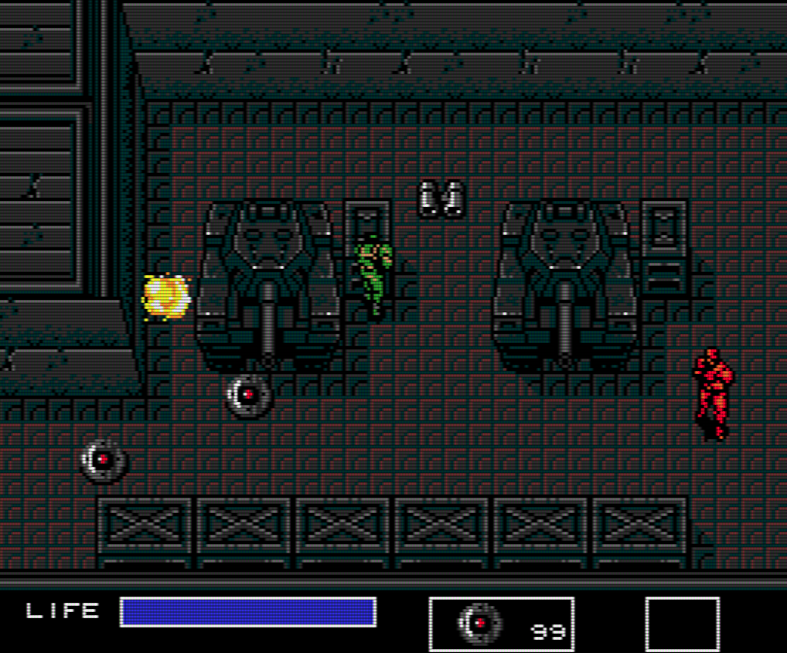
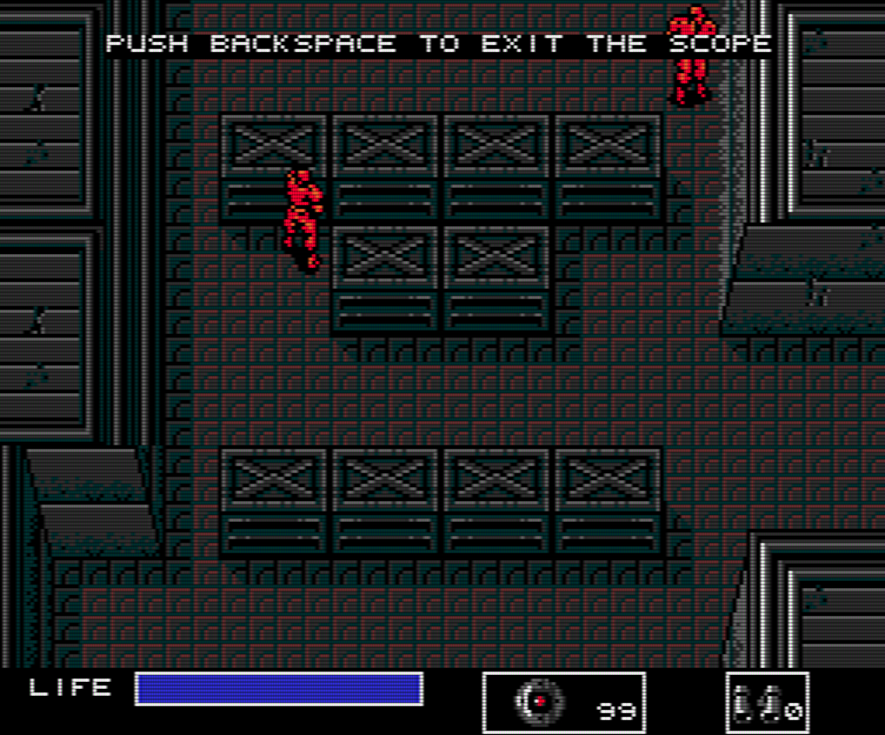
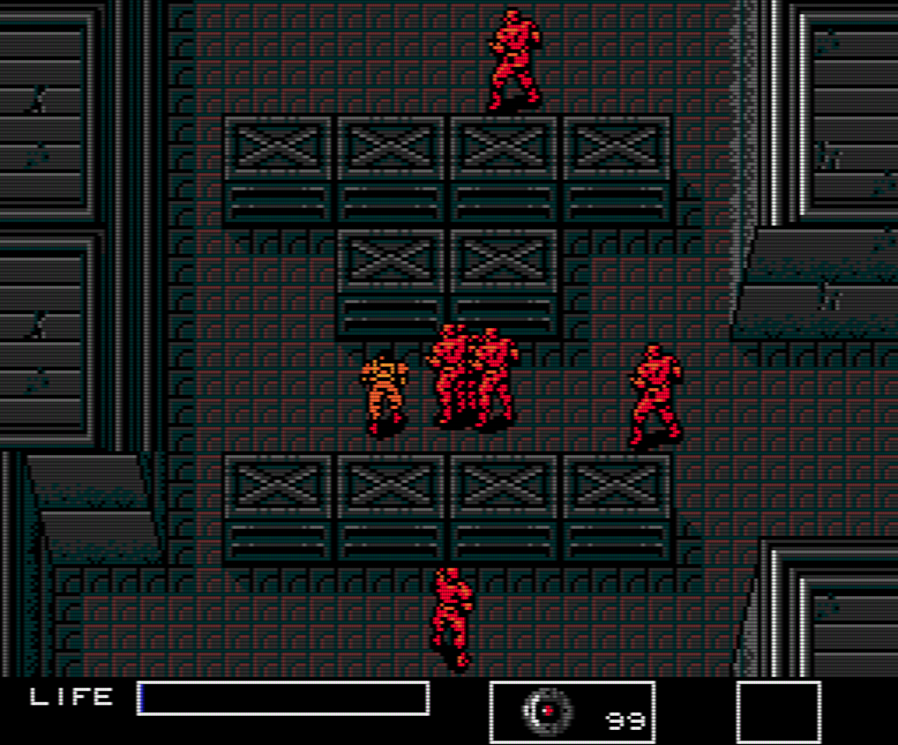

# Metal Gear 1 MSX2 Outer Heaven Remake

## Description
Metal Gear 1 MSX2 remake of the first floor of Outer Heaven. It is written in C++ with, except for a template and an audio library, no external dependencies. Not even STL.

### Screenshots
|  |  |
| -------------------------------------- | ---------------------------------- |
|           |  |

## Installation and Setup
Clone the repository, open the MSVS2022 solution, and press `F5`.
> Currently works on most Windows systems. Future updates may include a CMake setup to support more platforms.

## Usage
The [usage](docs/USAGE.md) has been moved to a seperate file.

## Dependencies

This project depends on:

- [Tmpl8 Template](https://github.com/jbikker/tmpl8) by Jacco Bikker for BUas
- [Minimalistic Audio Library](https://github.com/jpvanoosten/Audio) by Jeremiah van Oosten
- [Graphics Library Framework (GLFW)](https://www.glfw.org/download)
- [OpenGL](https://www.opengl.org/)
- Probably more that I forgot to mention...

## Cause
This project was created for BUas' CMGT Year 1 Block A assignment.
